```{r}
#| label: setup
#| echo: false
# minimal setup chunk
```

# Screenomics 3.0: A Framework for Visual Digital Trace Research

---

## Why Study Real-World Digital Interactions?

{.r-stretch}

## Characteristics of Real-World Interactions

* Increasing reliance on [digital media]{.neon-green}.
* Interactions are [rapid and bursty]{.neon-green} across platforms.
* [Fragmentation]{.neon-green} of content categories.
* [Time domain]{.neon-green} issues: exposure over short vs. long intervals.
* [Idiosyncrasy]{.neon-green} across individuals.
* All of these challenge [conventional social and behavioral research methods]{.neon-cyan}.

---

## Challenges in Capturing Digital Trace Data {background-image="imgs/nilam.jpg" background-opacity="0.2"}

### Screens as Digital Trace Data (DTD)

:::: {.columns}
::: {.column width="70%"}

* DTD: "records of activity (trace data) undertaken through an online information system (thus, digital)." [(Howison et al., 2011).]{.citation}
* Screens vs. platform APIs & data donation:

  * platform-specific vs. [user-specific]{.neon-green} [(Ohme et al., 2024).]{.citation}
  * capture a [broader spectrum]{.neon-green} of interactions
  * [multimodality]{.neon-green}: images, text, interface elements, mixed content
  * flexible [unit of analysis]{.neon-green} (screen, session, episode)
  * ease of [passive data collection]{.neon-green}
:::
::: {.column width="30%"}
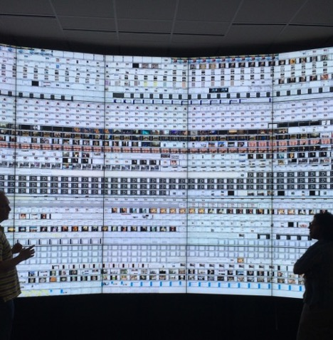{width="100%"}
:::
::::

---

## The Stanford Human Screenome Project

### Screenome: Capturing Real-World Interactions

:::: {.columns}
::: {.column width="60%"}

* Captures smartphone screens every **5 seconds (or less)**.

* ~**500 million screens** from over **1,000 people** for up to **1 year**.

* Privacy, risk, and [data security]{.neon-green} considerations.

* Linkage to periodic [surveys]{.neon-green} and health measures.

* A foundational move from [screen time]{.neon-cyan} to [screen content]{.neon-cyan}.
:::
::: {.column width="40%"}
{width="100%"}
[Reeves et al. (2020). *Nature*; Reeves et al. (2021). *Human–Computer Interaction*.]{.citation}
:::
::::

---

## Expanding on the Screenome Approach

### Transition to Screenomics 3.0

:::: {.columns width="60%"}
::: {.column}

1. **Screenome 1.0** – research infrastructure & conventional ML-based measurements.
2. **Screenome 2.0** – deep learning-based content analysis.
3. **Screenomics 3.0** – multimodal encoders and large multimodal models (LMMs).

[What changes in 3.0?]{.neon-cyan}

* screens become [vectors in multimodal space]{.neon-green}
* clustering, retrieval, and labeling become scalable
* inductive exploration and hypothesis generation become much easier
:::
::: {.column width="40%"}
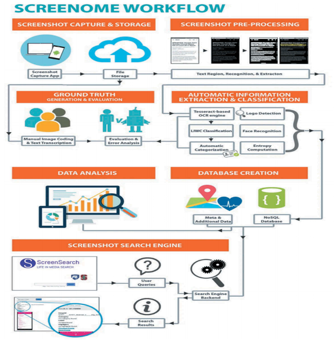{width="100%"}
[Cho et al. (in prep.).]{.citation}
:::
::::

---

## ML-Based Content Analysis & Mixed Methods

### Media Sequencing and Family Dynamics

:::: {.columns}
::: {.column}

* Homeostatic mechanism of [media sequencing]{.neon-green} in everyday life.
* Young adults’ smartphone interactions with [family]{.neon-green}.
* ML-based content analysis combined with [qualitative interviews]{.neon-green} and diary methods.
* Focus on how digital interactions [sequenced with offline interactions]{.neon-green} shape family dynamics.
:::
::: {.column}
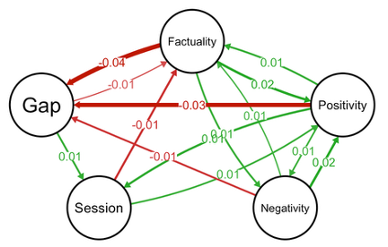{width="100%"}
[Cho et al. (2023). *Heliyon*.]{.citation}
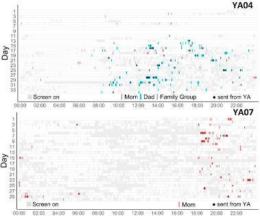{width="100%"}
[Sun et al. (2023). *Journal of Social and Personal Relationships*.]{.citation}
:::
::::

---

## ML-Based Content Analysis & Mixed Methods

### Mental Health via Screenome

:::: {.columns}
::: {.column}

* Linking [survey measures]{.neon-green} with [digital trace data (DTD)]{.neon-green}.
* Depression, state anxiety, ADHD, and happiness tracked longitudinally.
* Person-specific models from [6.7M screenshots]{.neon-green} and repeated surveys.
* Strong within-person couplings can emerge, but [the configuration differs across individuals]{.neon-cyan}.
* Suggests a move toward [idiographic media psychology]{.neon-cyan} and precision mental health.
:::
::: {.column}
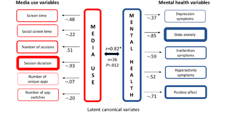{width="100%"}
[Cerit et al. (2025). *JMIR Formative Research*.]{.citation}
:::
::::

---

## Deep Learning-Based Content Analysis

### Visual Emotions, Scene Recognition, Food Detection

:::: {.columns}
::: {.column}

* CNN-based [scene recognition]{.neon-green} to categorize environments.
* CNN-based [food detection]{.neon-green} for identifying food-related content.
* Visual emotion recognition (valence and arousal) from screen images.
* Weekly trends: link [visual emotion trajectories]{.neon-green} to well-being.
:::
::: {.column}
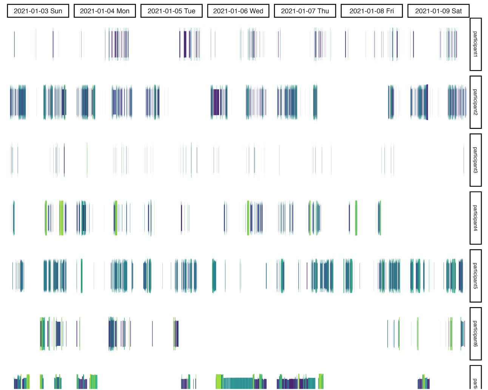{width="100%"}
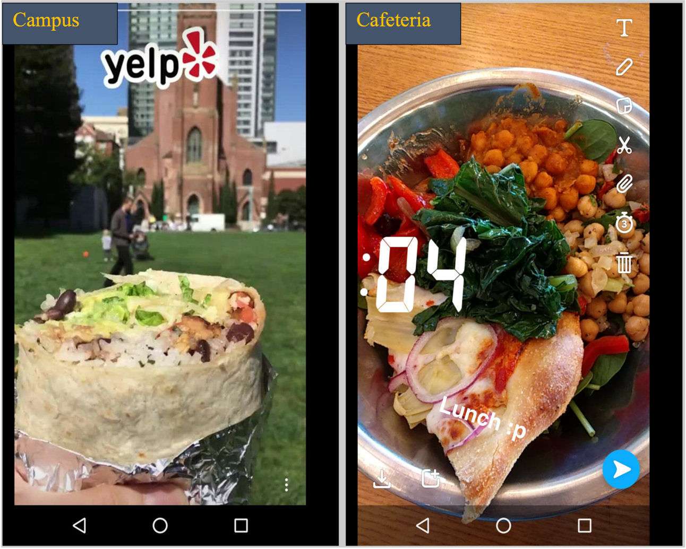{width="100%"}
:::
::::

---

## Multimodal Encoders and LMMs

### Adolescents’ Food-Related Content Exposure

:::: {.columns}
::: {.column}

* **20 adolescents**, 1-week observation of smartphone screens.
* **3%** of all exposure is food-related; **0.6%** branded.
* Demonstrates how a specific [content category]{.neon-green} can be mined from large screen sets.
* Shows feasibility of [longitudinal content tracking]{.neon-green} at the screen level.
:::
::: {.column}
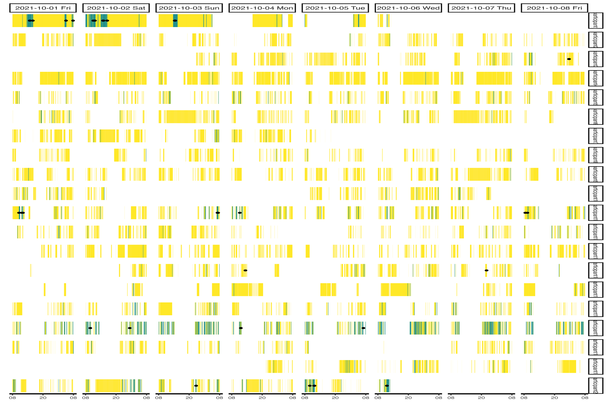{width="100%"}
[Cho et al. (in prep.).]{.citation}
:::
::::

---

## Multimodal Encoders and LMMs

### Spatial + Behavioral Clusters with CLIP & OCR

:::: {.columns}
::: {.column}

* [Screenotype]{.neon-green}: unique screenomes associated with behaviors and experiences.
* **HDBSCAN + UMAP** on **320K** data points for cluster analysis.
* **26 distinct clusters**; ~19% non-noise.
* [Within-app CLIP variance > between-app variance]{.neon-cyan} → rich within-app heterogeneity.
:::
::: {.column}
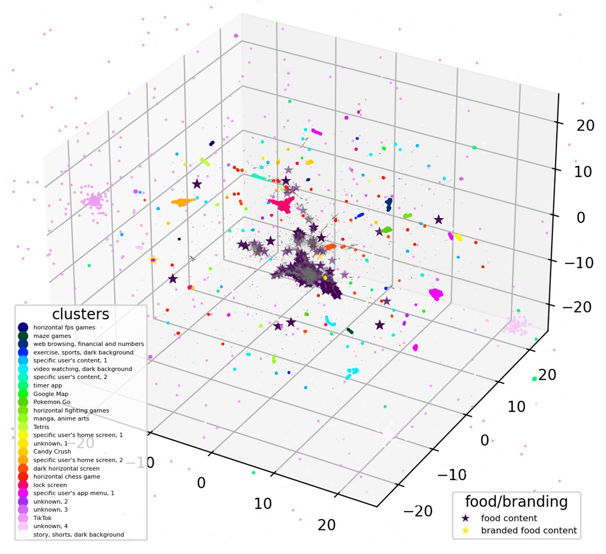{width="100%"}
[Cho et al. (in prep.).]{.citation}
:::
::::

---

## Multimodal Encoders and LMMs {background-image="imgs/atlas.png" background-opacity="0.2"}

### Mapping Digital Screen Content

:::: {.columns}
::: {.column}

* [Media Content Atlas]{.neon-green} for open-ended exploration of digital media interactions.
* Content mapping with **HDBSCAN + UMAP** on **1.12M** data points from **112 participants**.
* Moves beyond app names and app categories toward [content-based clustering]{.neon-cyan}.
* Supports hypothesis generation about [media repertoires]{.neon-green} and [use patterns]{.neon-green}.
:::
::: {.column}
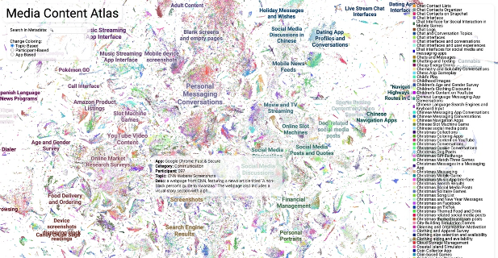{width="100%"}
[Cerit et al. (2025). CHI EA.]{.citation}
:::
::::

---

## Multimodal Encoders and LMMs {background-image="imgs/atlas_infra.png" background-opacity="0.1"}

### Mapping Digital Screen Content

:::: {.columns}
::: {.column}

* [Image + text embeddings]{.neon-green} combined.
* Large multimodal model (LMM) descriptions.
* Topic label generation for clusters of screens.
* [Information retrieval]{.neon-cyan}: querying screens and descriptions for

  * content categories
  * usage contexts
  * theoretically relevant concepts
:::
::: {.column}
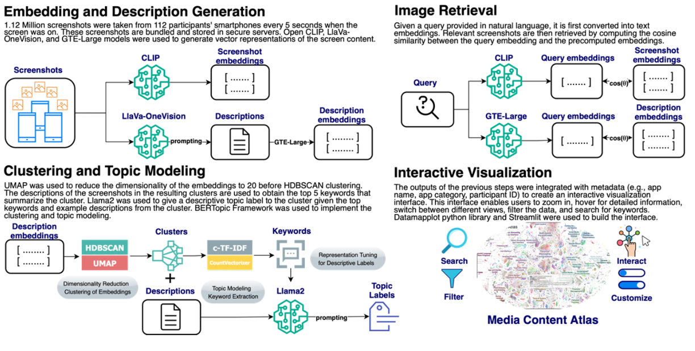{width="100%"}
[Cerit et al. (2025). CHI EA.]{.citation}
:::
::::

---

## Screenomics 3.0 Architecture

### Overall Pipeline

:::: {.columns}
::: {.column}

* **Screenomes**: longitudinal smartphone screenshots.
* **Image encoder** (CLIP, EVA-CLIP, e5-V) → image embeddings.
* **OCR engine** → text from screens.
* **Text encoder** → document embeddings.
* **Task-specific labels** with LMM + PEFT.
* Human labels + synthetic labels together support scalable annotation.

[This is the technical backbone of Screenomics 3.0.]{.neon-cyan}
:::
::: {.column}
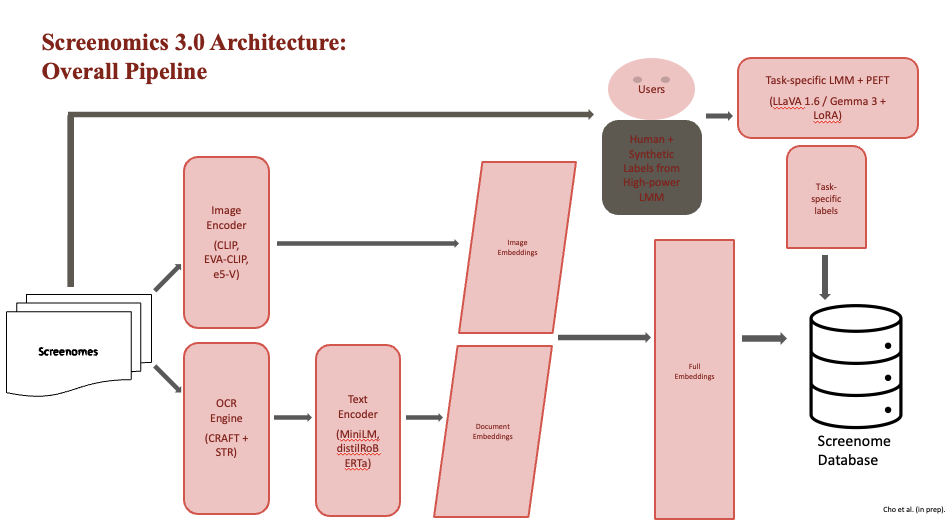{width="100%"}
[Cho et al. (in prep.).]{.citation}
:::
::::

---

## Screenomics 3.0 Architecture

### Text-to-Image Retrieval with CLIP

:::: {.columns}
::: {.column}

* Compute [cosine similarity]{.neon-green} between text queries and image embeddings.
* Efficiently find [relevant and irrelevant]{.neon-green} images.
* Supports rapid creation of [balanced labeled datasets]{.neon-green}.
* Enables exploratory analyses of [usage contexts]{.neon-green} and media patterns.
:::
::: {.column}
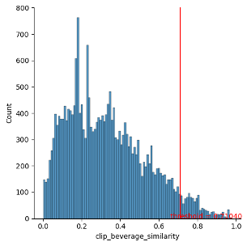{width="100%"}
:::
::::

---

## Screenomics 3.0 Architecture

### Human Labels with Label Studio

:::: {.columns}
::: {.column}

* **Label Studio** for customized labeling interfaces across projects.
* Supports [multiple annotation tasks]{.neon-green} (food presence, valence, task type, etc.).
* Reliability remains a key challenge:

  * consistent instructions
  * quality control
  * adjudication
:::
::: {.column}
{width="100%"}
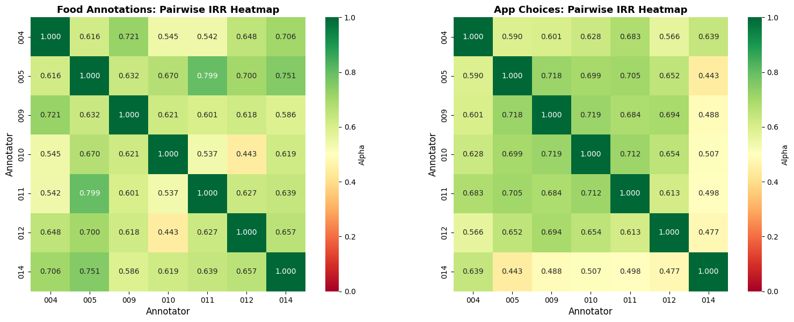{width="100%"}
:::
::::

---

## Screenomics 3.0 Architecture

### Task-Specific Labels with Large Multimodal Models

:::: {.columns}
::: {.column}

* **LLaVA** and related open-source LMMs enable:

  * [VQA]{.neon-green} over smartphone screens
  * [PEFT]{.neon-green} for task-specific labeling
  * large-N inference over millions of screens
* Competitive families now include:

  * Gemma 3
  * Qwen2.5-VL
  * Llama 3.2-V
:::
::: {.column}
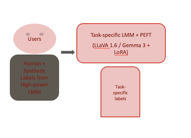{width="100%"}. 
[Liu et al. (2023).]{.citation}
:::
::::

---

## Screenomics 3.0 Architecture

### PEFT with LoRA

:::: {.columns}
::: {.column}

* LoRA makes large-model fine-tuning [feasible on modest hardware]{.neon-green}.
* Freeze the base model, train only small low-rank adapters.
* Reduces trainable parameters and memory footprint substantially.
* In practice, this is what makes domain-specific screen labeling much more manageable.
:::
::: {.column}
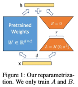{width="70%"}

[Hu et al. (2021).]{.citation}
:::
::::

---

## Multimodal Encoders and LMMs

### High-Level Behavioral Constructs

:::: {.columns}
::: {.column}

* LMM-based measurement of [user activity]{.neon-green} and [intention]{.neon-green}.
* Combine commercial solutions with prompt engineering.
* Measure higher-level behavioral constructs (e.g., consuming media, functional activities).
* One application: Krippendorff’s Alpha = 0.877, precision = 0.92, recall = 0.91.
* Opens the door to measuring [meaningful psychological constructs]{.neon-cyan}, not just raw content.
:::
::: {.column}
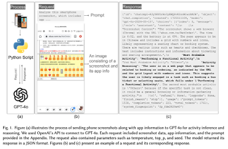{width="100%"}
[Chang et al. (under review).]{.citation}
:::
::::

---

## Pitfalls and Future Directions

### Challenges, Limitations, & Future Possibilities

* Over-reliance on models can lead to [subtle biases]{.neon-green} or overconfidence in results.
* Need for [interpretability tools]{.neon-green} to better understand model decisions.
* Infrastructure is improving: open-source Screenomics now supports more flexible, customizable multimodal data collection.
* Importance of [interdisciplinary collaboration]{.neon-cyan} for domain-specific content analysis. [Kim et al. (2026). *Nature Health*]{.citation}
* Future expansions:

  * efficient model training and inference
  * real-time analytics
  * richer multimodal streams
  * user feedback and participatory design


---

## Key Takeaway

Screenomics shifts the study of media behavior from [how long people use media]{.neon-green} to [what people actually experience in digital environments]{.neon-cyan}.

---

## Transition

If digital life can now be measured at this level of resolution, then the next question is not only [what people see]{.neon-green}, but also [what kinds of styles and meanings emerge across media content]{.neon-cyan}.

---

# Some related ideas…

---

## {background-video="vids/jh.mp4" background-size="100%"}

---

## The Puzzle

- Digital media research often measures:
  * **Time spent**
  * **Platform usage**
  * **Interaction counts**

- But these measures miss something fundamental.

- Digital environments are fundamentally **symbolic environments**. People interact with:
  * **Images & language**
  * **Multimodal cues, e.g., audiovisual**
  * **Cultural symbols**

- What spreads in these environments is not only information, but also **styles, meanings, and signals**.

---

## The Transition

Something similar may now be happening in the study of **human communication and behavior**.

- For the first time we can observe large-scale digital interaction environments with high resolution:
  * Screenomics
  * Digital trace data
  * Multimodal communication archives

- Combined with:
  * Multimodal embeddings
  * Large language and vision models

- These data allow us to study **systems of meaning** in digital media.

---

## The Analogy

- Another scientific field recently underwent a similar transformation: **biology**. For much of its history, biology was:
  * **Descriptive & observational**
  * **Limited by measurement tools**

- Once biological systems became **digitally measurable**, the field changed. Researchers could integrate:
  * **Genomic data**
  * **Imaging data**
  * **Physiological measurements**
- Biology became increasingly **computational and model-driven**.

---

## Next Project: Communication Styles in Social Media

- This motivates the next project. Instead of analyzing individual posts or messages, we ask:
[**Can we identify systematic communication styles in multimodal political media?**]{.neon-green}

- To answer this question, we developed a pipeline that:  
  1. Processes raw social media videos
  2. Extracts visual, vocal, and textual features
  3. Identifies recurring multimodal communication styles

- The next section introduces this framework.

---

# From Digital Trace Data to Communication Styles

## A Framework for Analyzing and Linking Multimodal Social Media Content

:::: {.columns}

::: {.column width="55%"}

* MJ Cho, Chingching Chang, Yuan Hsiao, Hen‑Hsen Huang
* RCHSS, Academia Sinica

:::

::: {.column width="45%"}

{width="100%"}

:::

::::

---

## The Challenge: A New Era for Media Effects Research

:::: {.columns}

::: {.column width="55%"}

- The field is shifting from **quantity of media use** to **content and its effects** [(Pouwels et al., 2024).]{.citation}
- **Nature Research Intelligence**: Multimodal communication as a frontier.  
- Multimodal communication is emerging as a major research frontier.
- Traditional methods are insufficient for highly fragmented media environments [(Ohme et al., 2024).]{.citation}

- **The video problem:**
  * Video is now a dominant form of social media content.
  * Video is inherently multimodal [(Kroon et al., 2024).]{.citation}
  * The audio channel remains understudied in communication research.

:::

::: {.column width="45%"}

{width="100%"}

:::

::::

---

## Multimodality and Media Psychology

{.r-stretch}

---

## Multimodality and Media Psychology

### Why Multimodal Thinking Matters

- Online media and platform–operator (PO) data are inherently **multimodal**.  
- **Format / schema** shape psychological effects.  
- Media theory is also multimodal:  
  - visual framing,  
  - vocal tone,  
  - textual content.  
- Psychological effects of **expression and tone**.  
- Social meaning of **objects and scenes**.  
- Our goal:  
  - Measurement of **styles**,  
  - Their **effects**,  
  - A coherent analytical framework.

---

## A Roadmap from the Literature & Our Contribution

### Three-Step Approach (Pouwels et al., 2024)

1. **Collect digital trace data** (DTD, e.g., via APIs, tracking).  
2. Perform **automated content analysis** (text and visuals).  
3. Conduct **linkage analysis** to study effects on outcomes.

### Our Contribution

- An **end-to-end framework** that operationalizes this approach for **video**.  
- Integrates visual, audio, and textual signals

---

## Our Framework: From Raw Videos to Communication Styles

:::: {.columns}
::: {.column}
- **Goal**: A replicable pipeline to transform raw videos into theoretically meaningful **communication styles**.

- **Data**:  
  - 398 Instagram videos from 12 U.S. Senate candidates during the 2024 election.

- **Three core stages**:  
  1. **Preprocessing** – Raw video files → analysis-ready data streams.  
  2. **Multimodal Feature Extraction** – Cleaned data streams → comprehensive behavioral features.  
  3. **Style Identification & Linking** – Feature sets → interpretable styles for linkage analysis.
:::
::: {.column}
{width="100%"}
:::
::::

---

## Stage 1: From Raw Video to Analysis-Ready Streams

:::: {.columns}
::: {.column}
- **Goal**: Preprocess and transform noisy social media video into **isolated communication sources**.

- **Visual filtering**:  
  - Isolate candidate presence using **face detection** (MediaPipe) and **recognition** (DeepFace).

- **Audio filtering**:  
  - Isolate candidate's voice using **denoising** (Demucs) and **speaker diarization** (PyAnnote).

- **Speech transcription**:  
  - Transcribe only the filtered candidate audio with **ASR (Whisper)**. 

- **Result**: A validated set of synchronized **video, audio, and text** data — only the **target communicator**.
:::
::: {.column}
{width="100%"}
:::
::::

---

## Stage 2: Quantifying Sight, Sound, and Speech

:::: {.columns}
::: {.column}
- **Visual features (nonverbal performance)**:  
  - Facial Action Units (AUs) → emotional expression.  
  - Head pose → engagement cues.  
  - Valence & arousal (EmoNet) → affective state.

- **Audio features (vocal performance)**:  
  - Prosodic cues → pitch (F0), intensity (MFCC0), speech rate.  
  - Vocal emotion → valence & arousal (wav2vec2).

- **Textual features (verbal content)**:  
  - Topic modeling (BERTopic) → substantive themes.
:::
::: {.column}
{width="100%"}
:::
::::

---

## Stage 3: Identifying Communication Styles

:::: {.columns}
::: {.column}
- **Goal**: Identify a meaningful typology of **styles** from thousands of features.

- **Unsupervised clustering** (K-Means / HDBSCAN):  
  - Discover data-driven patterns across multimodal feature space.

- **LLM-assisted labeling**:  
  - Bridge quantitative patterns with **qualitative meaning**.  
  - Derive interpretable **style labels**.

- Example styles identified (audiovisual):  
  - "Cheerful Energetic"  
  - "Stony Warm"  
  - "Concerned Articulate"  
:::
::: {.column}
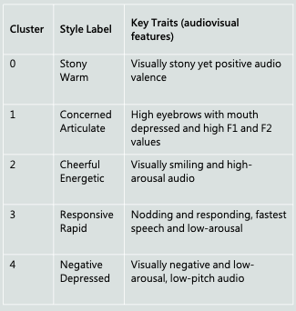{width="100%"}
:::
::::

---

## Stage 3: Tri-Modality Communication Styles

### Styles from Visual, Audio, and Text Combined

<!-- :::: {.columns}
::: {.column}
- **Tri-modality cluster styles** capture interplay between:  
  - Visual behavior,  
  - Vocal delivery,  
  - Verbal content.

Example cluster types:

- **Formal Low-Energy Neutral**:  
  - ↓ Clout, ↓ Certitude, ↓ Tone, ↓ MFCC0, ↓ AUs, ↑ Neutral emotion.  
  - Flat, factual delivery, avoids emotion or confrontation.

- **Casual Expressive Happy**:  
  - ↑ Pronouns, ↑ filler, ↑ MFCC0, ↑ AU06 (smile), ↑ Happiness, ↓ Negative tone.  
  - Friendly, warm; aims to build rapport.

- **Analytic Calm Neutral**:  
  - ↑ Analytic language, ↑ word count, ↓ arousal, ↑ neutral face and tone.  
  - Informative, calm delivery to establish expertise.

- **Emotive Dynamic Angry**:  
  - ↑ Risk language, ↑ anger (text/audio), ↑ MFCC0, ↑ AU04/20, high anger scores.  
  - Emotionally intense delivery, likely to provoke or mobilize.

- **Empathic Warm Positive**:  
  - ↑ social/family words, ↑ positive emotion, ↑ AU12 (smile), ↑ tone, ↓ fatigue.  
  - Builds trust via warmth and positivity.
:::
::: {.column}
[Figure placeholder: Table of tri-modal styles]
:::
:::: -->

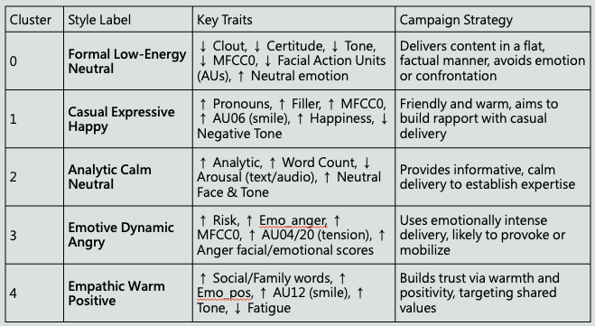{width="100%"}

---

## Validating the Styles

### Distribution Across Parties

:::: {.columns}
::: {.column}
- **Goal**: Demonstrate the validity of computationally derived styles.

- **Results**: Styles systematically vary by **political party**.

- **Visual styles**:  
  - Democrats: more likely to use "Cheerful" and "Excited" styles.  
  - Republicans: favor "Serious," "Frowning," and "Still" visual approaches.

- **Audio styles**:  
  - Democrats: more often use a "Rapid" vocal style.  
  - Republicans: more often use a "Somber" tone.

- **Audiovisual styles**:  
  - Democrats: "Cheerful Energetic".  
  - Republicans: "Concerned Articulate" and "Negative Depressed".
:::
::: {.column}
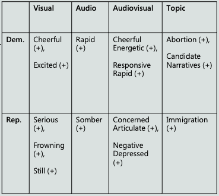{width="100%"}
:::
::::

---

## Style Effectiveness and Party Differences

### How Style Effectiveness Varies by Party

:::: {.columns}
::: {.column}
- The **effectiveness** of a communication style often depends on **party**.

- Examples:  
  - "Neutral Calm" audiovisual style generates **high engagement** for Republicans but **very little** for Democrats.  
  - Democrats benefit more from a "Cheerful Energetic" approach, which is less effective for Republicans.

- Implication: Style is not universally good or bad; its impact is **conditional on identity and context**.
:::
::: {.column}
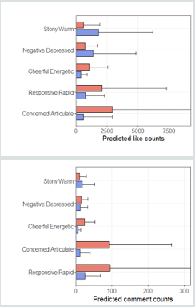{width="100%"}
:::
::::

---

## What This Framework Enables

- This approach makes it possible to:
  * Quantify how messages are delivered
  * Study multimodal communication styles
  * Link communication styles to audience outcomes

- This moves media effects research from:
  * [**What is said → How communication is performed**.]{.neon-green}


---

## Why All These Matters?

- Public controversies today unfold in a radically different information environment.
  * Citizens encounter **massive volumes of fragmented information**.
  * Algorithms curate different realities for different users.
  * Competing narratives circulate simultaneously across platforms.

- As a result, many disagreements are not simply disagreements in values, but **what people believe the world actually looks like**.
- **Key question:**
  * Can human–AI interaction systems help people *navigate complex information environments* and understand controversial issues more clearly?

---

## A Tale of Scientific Evolution

- When Biology Becomes Computable, Mind Becomes Modelable
  * Cognition emerges from biological information processing.
  * Multi‑scale biological models create mechanistic foundations for psychological theory.
  * Integrated biological + digital‑trace data enables predictive models of behavior.
  * Synthetic agents and personas become useful testbeds for psychological mechanisms.
  * Psychology shifts from primarily correlational explanations toward mechanistic and intervention‑driven science.

---

# Human–AI Interaction for Understanding Online Public Opinion

---

## Asis-RAG: A Human–AI Interaction System for Exploring Online Public Opinion

This project examines whether human–AI interaction systems can help citizens better understand controversial policy debates by combining:

* AI‑generated summaries
* Structured viewpoint exploration
* Interactive question‑answering agents

---

## Research Team and Background

:::: {.columns}
::: {.column}


- Project goal:
  * Improve citizens' understanding of complex public controversies
  * Support more reflective and evidence‑based discussion

- Research foundation:
  * Large‑scale Taiwanese online public‑opinion databases
  * Retrieval‑augmented generation (RAG) system integrating real public discourse

:::
::: {.column}
{width="100%"}

- Research team: MJ Cho, An-Ting Hsieh, Yu-Wei Huang, Chingching Chang, Yuan Hsiao, Hen‑Hsen Huang, Yung‑Ju Chang
:::
::::

---

## Roots of Social Controversy: Gaps in Understanding

:::: {.columns}
::: {.column}
- Public controversies often persist not only because of disagreement, but because citizens encounter **fragmented and selectively presented information**.
  * Selective exposure and motivated reasoning
  * Algorithmic filtering and echo chambers
  * Fragmentation of public discourse across platforms
  * Declining shared epistemic authority

- These dynamics make it difficult for citizens to form a coherent understanding of complex issues.
:::
::: {.column}
{width="100%"}
:::
::::

---

## System Design: Human–AI Interaction Components

:::: {.columns6040}
::: {.column}
The system integrates three major components.

1. **AI‑generated video summary**  
    * LLM summarizes long debate videos into structured key points.
2. **Viewpoint spectrum interface**   
    * Visualizes opposing standpoints across multiple policy dimensions.
    * Users can click on different positions and read real arguments from politicians, experts, and public figures retrieved through RAG.
3. **Interactive Q&A agent** 
    * Suggests relevant questions related to the video content.
    * Users can ask follow‑up questions and retrieve supporting evidence from a public opinion database.

:::
::: {.column}
{width="100%"}
:::
::::

---

## Experimental Design

:::: {.columns6040}
::: {.column}

- We conducted a controlled experiment with **64 participants** across four interface conditions.
  a. Video summary only
  b. Video summary + viewpoint spectrum
  c. Video summary + Q&A agent
  d. Video summary + viewpoint spectrum + Q&A agent

:::
::: {.column}
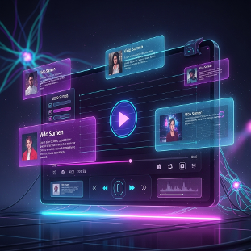{width="100%"}
:::
::::

---

## Experimental Design Cont.

:::: {.columns}
::: {.column}
- Participants watched a debate video on the **Fourth Nuclear Power Plant referendum in Taiwan**, interacted with the system, and then completed post‑interaction surveys and knowledge tests. Measures included:
  * Issue knowledge
  * Attitude positions across multiple policy dimensions
  * Critical thinking self‑assessment
  * System usability and workload
:::
::: {.column}
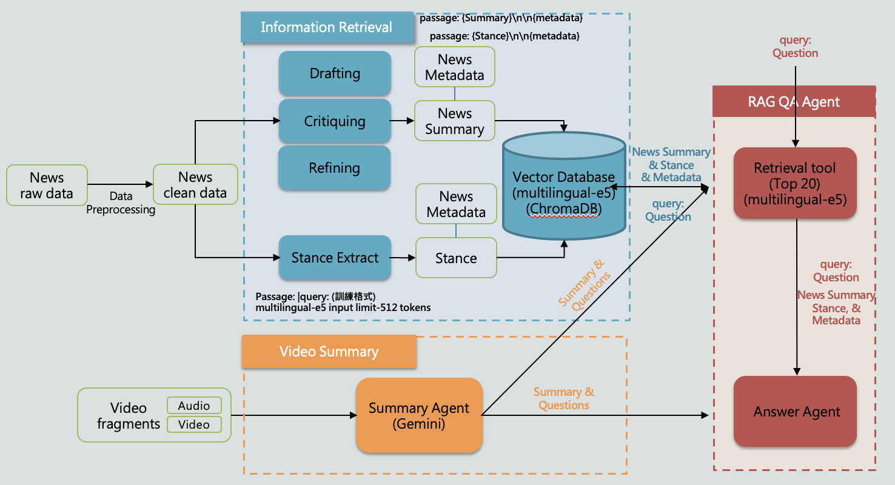{width="100%"}
:::
::::

---

## Real-time Human–AI Interaction for Public Opinion Research

{.r-stretch}

---

## User Interaction Behavior

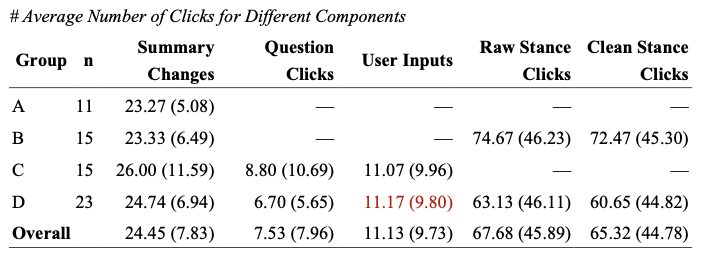{width="100%"}

- System logs show that participants actively explored the interface components. Examples of interaction patterns:
  * Users frequently revisited the AI summary while interacting with other components.
  * Participants in Q&A conditions asked an average of about **11 questions** during the session.
  * Participants in viewpoint spectrum conditions clicked stance nodes **60–70 times on average**, indicating active exploration of perspectives.

- These results suggest that users did not passively consume AI output, but **actively navigated between summaries, perspectives, and questions**.

--- 

## Effects on Issue Understanding

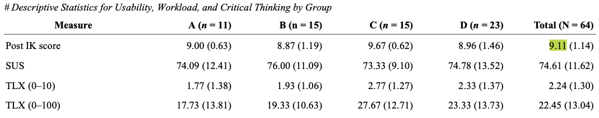{width="100%"}

- Participants performed strongly on post‑test knowledge questions about the debate. Average knowledge score
  * **9.11 out of 10 across all conditions**.
  * This indicates that the AI‑assisted system successfully conveyed key factual information from the debate.


---

## Attitude Change and Polarization

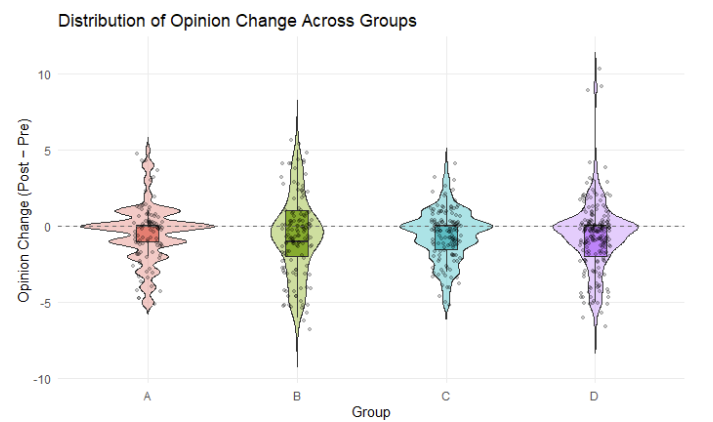{width="100%"}

- Across conditions, participants' attitudes remained **largely stable overall**.
  * Most opinion changes were small and centered around zero.
  * Some sub‑issues showed moderate shifts.
  * Participants with stronger initial attitudes tended to move slightly toward the midpoint of the scale.

- This suggests a **possible mild depolarization effect** rather than strong persuasion.

---

## Regression Evidence

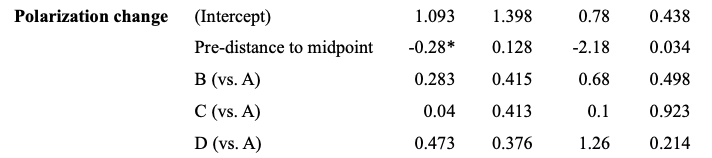{width="100%"}

- Regression models further clarify the mechanisms behind attitude change.
  * **Pre‑existing attitudes strongly predict post attitudes.**
  * The **viewpoint spectrum condition (Group B)** shows greater absolute attitude change than the summary‑only baseline.
  * Participants with stronger initial attitudes tend to move **slightly toward the midpoint**, suggesting mild depolarization.

---

## What These Results Suggest

- The system does **not strongly persuade users**. Instead, it appears to support **reflective exploration of complex issues**.

- Observed patterns:
  * Users actively explored different viewpoints and questions.
  * Knowledge acquisition was high.
  * Attitudes remained mostly stable, with occasional moderation effects.

- This suggests that human–AI systems may function as **cognitive scaffolding for public reasoning**, rather than persuasion tools.

---


## A New Phase for Social Science

- Behavior becomes measurable across multiple layers:

* Cognitive processes
* Digital trace environments
* Human–AI interaction systems

- This integration allows researchers to study how people understand complex issues in **real interaction environments**, not only through surveys.

- The result may be a new phase of social science:
  * **A designable science of human understanding.**

---

## Thank You

### Questions?

:::: {.columns}
::: {.column}

Human–AI interaction may allow us to move beyond simply measuring public opinion.
Instead, we can begin to [**design systems that help people understand complex issues**.]{.neon-green}


:::
::: {.column}
{width="30%"}

#### Mu-Jung ’MJ’ Cho | 卓牧融 
[mjcho@as.edu.tw]{.neon-red}

:::
::::

